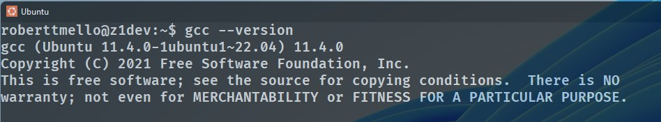
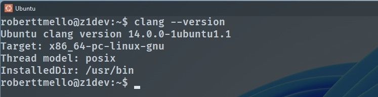

# Curso Completo de C - Introdução a programação

## Introdução

🧑‍💻 Este curso é baseado no excelente guia do professor **Brian Beej Jorgensen**, disponível em inglês gratuitamente nesse [**LINK**](https://beej.us/guide/bgc/). 😎

## Pré-requisitos para curso

- 👉 Apesar de ser desejável, você não precisa ter conhecimento em nenhuma outra linguagem de programação para acompanhar esse curso. Aproveitando o excelente material do professor **Beej** eu vou tentar te passar as coisas de forma bem passo a passo.  

- 👉 Para ter sucesso nesse curso, como em qualquer outro, você precisa ser curioso, praticar e persistir até entender os conceitos.
  
- 👉 Nesse curso vamos interagir de forma básica com **terminal** do nosso sistema, apenas para compilar nossos programas e talvez criar algumas pastas, nada além disso. Se você não sabe nada de terminal, não se assuste, dá pra ir aprendendo no decorrer das aulas. Mas recomendo que pesquise os comandos básicos do terminal do seu sistema operacional. Acredite, uma vez ná área de desenvolvimento de software, o terminal sempre será um dos seus **best friends**!    

## Ferramentas
- 👉 Para acompanhar esse curso você precisa apenas de um **editor de código** e um **compilador da linguagem C** instalado na sua máquina. O editor que vou usar é o [**VSCode**](https://code.visualstudio.com/download) e o compilador será o **GCC (GNU Compiler Collection)**.

### Instruções para usuários Linux

- 👉 Se você usa alguma distribuição **linux** como sistema operacional, provavelmente o **gcc** já estará instalado, caso não, apenas rode esse comando no seu terminal: 

```sh
sudo apt install gcc

``` 
### Instruções para usuários Windows

- 👉 Para quem usa Windows o recomendado é instalar o [**WSL**](https://learn.microsoft.com/en-us/windows/wsl/install) e instalar o gcc como na instrução anterior (setup que vou usar no curso). Caso não queira instalar o wsl não haverá nenhum problema. Você pode instalar o gcc através do [**MinGW**](https://sourceforge.net/projects/mingw/) por exemplo, e usar o terminal padrão do windows como o **cmd**, **powershell** ou o mais **novo terminal da microsoft**. 

- 👉 Lembrando que no windows você precisa adicionar o caminho de instalação do gcc no **PATH** do seu sistema através das variáveis de ambiente. Se você não sabe fazer isso acessa a [**página oficial do vscode com as instruções**](https://code.visualstudio.com/docs/cpp/config-mingw#_prerequisites). 

### Instruções para usuários Mac

- 👉 Se você é usuário **Mac** vai precisar instalar o [**XCode**](https://developer.apple.com/xcode/). Provavelmente a sua máquina já tem instalado o **Clang** que também é um compilador C. Caso não esteja acesse esse [**LINK**](https://www.freecodecamp.org/news/install-xcode-command-line-tools/) para mais instruções.

## Testando o compilador

- 👉 Independente do seu sistema operacional você precisa do compilador C instalado corretamente para iniciarmos a nossa diversão nesse curso. Para testar a instalação basta abrir seu terminal linux, windows ou mac e digitar:

```sh
gcc --version
``` 
ou

```sh
clang --version
```

👉 Você deve ver uma saída como essas abaixo: 

- 👉 **GCC**:
  


- 👉 **Clang**: 
  


## Aprenda a pesquisar sobre suas dúvidas e problemas

- Caso você não tenha conseguido instalar algumas das ferramentas corretamente é hora de aprender a primeira lição do curso. **Sempre seja proativo para pesquisar no Google sobre como resolver seus problemas.** Procurar soluções para problemas específicos na internet é uma das habilidades básicas mais importantes de todo programador.